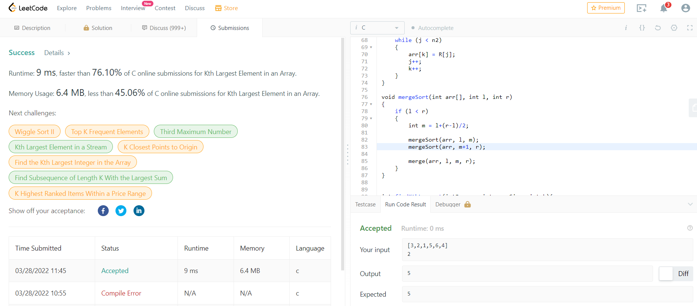
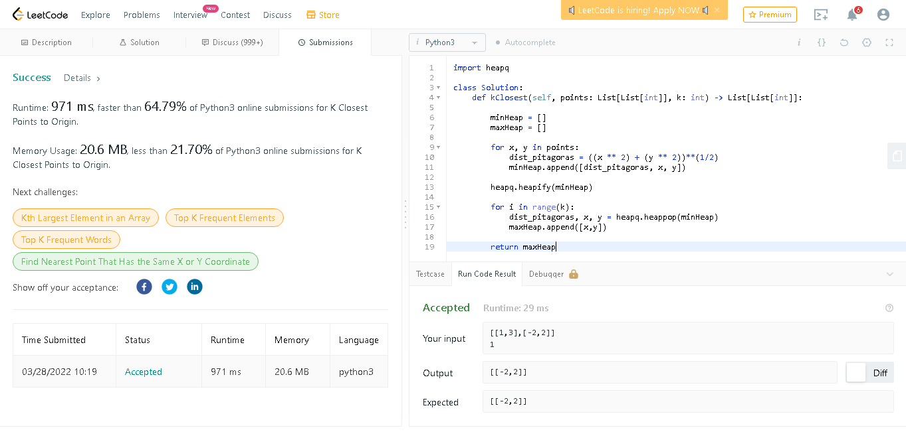
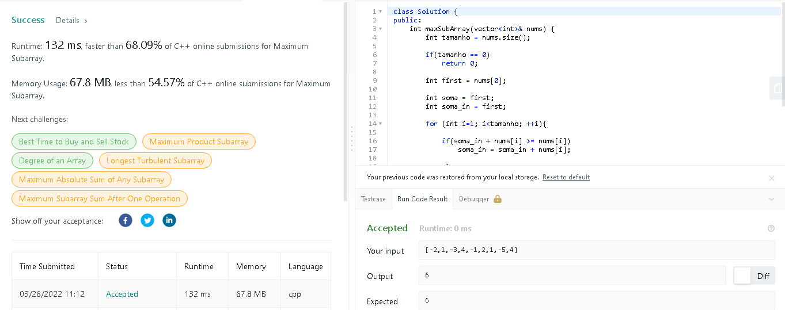

Temas:
 - D&C

# D-C Dupla 18

**Número da Lista**: 18<br>
**Conteúdo da Disciplina**: D-C Dividir e Conquistar<br>

## Alunos
|Matrícula | Aluno |
| -- | -- |
| 18/0100831  |  Gabriel Avelino |
| 18/0103431  |  João Victor Valadão |

## Sobre 
Para essa entrega de D-C o nosso grupo resolveu 3 questões de juízes onlines (Online Judges) para mostrar o conhecimento sobre Dividir e Conquistar. Os links das questões resolvidas:

### Questão 1
Kth largest element - Nível Médio
- https://leetcode.com/problems/kth-largest-element-in-an-array/

### Questão 2
K Closest Points to Origin - Nível Médio
- https://leetcode.com/problems/k-closest-points-to-origin/

### Questão 3
Maximum subarray - Nível Médio
- https://leetcode.com/problems/maximum-subarray/

## Apresentação

Link do vídeo da apresentação:

[](https://youtu.be/WEBYgR7Neh0)

## Screenshots

Accepteds pelo leetcode dos problemas acima

### Kth Largest Element


### Closest Points


### Maximum Subarray


## Instalação 
**Linguagem**: Python e C<br>
**Framework**: Não existe<br>

Para rodar as questões é preciso fazer os seguintes passos: 

```jsx
Navegue até o diretório em que o arquivo se encontra e digite:

Questão 1
gcc kth_Solution.c
./a.out

Questão 2
gcc solution.c
./a.out

Questão 3
python ou python3 solution.py

```

## Uso 
Para alterar os dados de entrada nas questões, mude os dados onde estão indicados nos respectivos arquivos de suas soluções.


